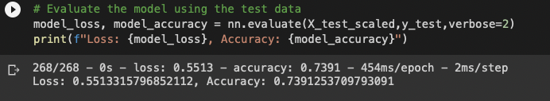
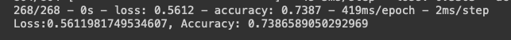
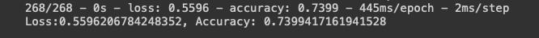

# Neural_Network_Charity_Analysis

## Source: 

[AlphabetSoupCharity](AlphabetSoupCharity.ipynb)

[AlphabetSoupCharity_Optimzation](AlphabetSoupCharity_Optimzation.ipynb)

## HDF5 Links:

[AlphabetSoupCharity.h5](AlphabetSoupCharity.h5)

[AlphabetSoupCharity_optimzation_Attempt1.h5](AlphabetSoupCharity_optimzation_Attempt1.h5)

[AlphabetSoupCharity_optimzation_Attempt2.h5](AlphabetSoupCharity_optimzation_Attempt2.h5)

[AlphabetSoupCharity_optimzation_Attempt3.h5](AlphabetSoupCharity_optimzation_Attempt3.h5)

## Overview
The purpose of this analysis was to Create a binary classifier that will tell the customer whether or not the applicants will be successful using alphabet soup using Neural Network.

## Results

### Data Preprocessing

To start, we needed to preprocess the data in order to compile, train and evaluate the neural network model.

- EIN and NAME columns were removed during the preprocessing stage as these columns added no value.
- IS_SUCCESSFUL column was the target variable.

**Compiling, Training, and Evaluating the Model**
Optimization Attempt #1:
   - 2 Hidden Layers
   - 50 neurons (Layer1), 25 neurons(Layer2)
   - Used Relu and Sigmoid Activations Functions since sigmoid is best for binary classifcation problems as this and relu is for nonlinear datasets.
 
The target performance for the accuracy rate is greater than 75%. The model that was created only achieved an accuracy rate of 73.91%

#### Conclusion : 
     while its a significant improvement from the original 72% , its not suffcienty higher expected accuracy the take this model for conclusion.

  
   
Optimization Attempt #2:
   - 3 Hidden Layers 
   - 80 neurons (Layer1), 40 neurons(Layer2), 20 neurons(Layer3)
   - Used Relu and Sigmoid Activations Functions since sigmoid is best for binary classifcation problems as this and relu is for nonlinear datasets.
   
The target performance for the accuracy rate is greater than 75%. The model that was created only achieved an accuracy rate of 73.87%

#### Conclusion : 
     Model2 is slightly lower Accuracy than Model1  -> 73.87% vs 73.91% 

  
   
Optimization Attempt #3:
   - 4 Hidden Layers
   - 80 neurons(Layer1), 40 neurons(Layer2), 20 neurons (Layer3), 10 neurons (Layer4)
   - Used Relu and Sigmoid Activations Functions since sigmoid is best for binary classifcation problems as this and relu is for    nonlinear datasets.
   
The target performance for the accuracy rate is greater than 75%. The model that was created only achieved an accuracy rate of 73.99%

#### Conclusion : 
     Model 3 Shows slight improment compare to Model 1 and Model 2

  
   

## Summary 
On Average my models kept around 74% accuracy score which is decent considering it was an improvement. My recommendation to improve this model would be to find better features to help explain what determines "IS_SUCCESFUL" such as more indepth knowledge of the other associates/ firms being funded.
